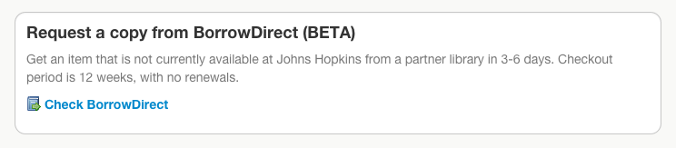
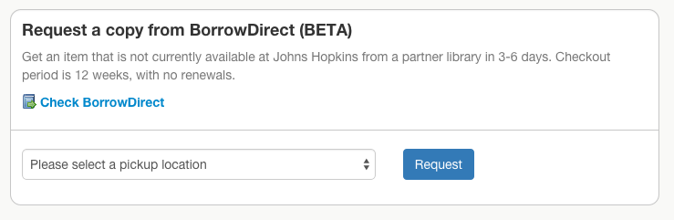
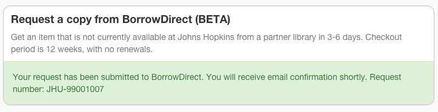

# UmlautBorrowDirect

IN PROGRESS

## UI Overview

At first, we planned to mainly focus on what the [BorrowDirect web service API's] could provide to a UI. 

While the API's are still used by this plugin, taking substantial code to accoplish, disabled), several factors resulted in the UI being a bit more centered around a direct link to author/title keyword search results in the standard BD interface instead. (Also, all use of the API's can be disabled if desired):

* BD API's are exclusively based on ISBN (at this time anyway) . So if we don't have an ISBN, we can't use them, and can only send user to standard BD interface. Even if we do have an ISBN, we can only get availability for that specific ISBN/edition, and in user testing and feedback we found users feel misled if we tell them "not in BD" when another equally good edition is available in BD. 
* BD reliability issues. Unreliable performance, generally slower than our users might want, and unpredictable error messages and results. In cases of a timeout or other error, we can do nothing but direct users to standard BD interface. And some users in testing preferred going right to standard BD interface rather than wait for API. 

The interface we ended up with is based on multiple iterations including user testing and staff feedback, but it is a compromise interface. It's possible you will want something different for your context -- please let us know, and we can probably make this plugin configurable to your needs if it is not already. 

A citation with no ISBN just shows link to standard BD interface:

For a citation with an ISBN, we will consult the BD API in the background (unless use_bd_api=false configured):

If the API says available, you get a request form right on page:

You will get confirmation on page after submitting:

Or if the API said not available, we'll suggest other editions might be and you might want to check:

(If BD API times out or errors, similar to above). 

## Installation

You have an Umlaut app already (Umlaut 4.1+ required)

### Add umlaut_borrow_direct to your Gemfile:

~~~ruby
gem 'umlaut_borrow_direct'
~~~

### Configure the service in your `config/umlaut_services.yml`

~~~yaml
    borrow_direct:
      type: BorrowDirectAdaptor
      priority: d
      library_symbol: YOURSYMBOL
      find_item_patron_barcode: a_generic_barcode_that_can_be_used_for_FindItem_lookups
      html_query_base_url: https://example.edu/borrow_direct
      #
      # Optional params
      # disable BD api entirely:
      use_bd_api: false
      # Set timeout for BD api in seconds (default 20 seconds)
      http_timeout: 10
      # log all BD API calls for analysis
      bd_api_log_level: info
~~~

If you want to take account of local availability, you want to use a priority
level later than your local holdings lookup service. 

html_query_base_url is the URL for a local script that does auth and redirect to BD.
Your local script needs to pass on the `query` query param too. (Have different
integration needs? Let us know)

TODO: Pointing at production vs dev borrowdirect. Right now it's always dev. 

### Configure display of BorrowDirect responses

In your local `./app/controllers/umlaut_controller.rb`, in the
`umlaut_config.configure do` section, add:

~~~ruby
# Adds borrow_direct section to page
resolve_sections.insert_section UmlautBorrowDirect.resolve_section_definition, :before => "holding"
# Supplies logic for when to highlight borrow_direct section
add_section_highlights_filter!  UmlautBorrowDirect.section_highlights_filter
~~~

### Add a local controller

(Not needed if `use_bd_api` set to `false`)

Placing a request with BorrowDirect requires the current user's barcode. But Umlaut 
has no login system at all, and even if it did it wouldn't know how to figure out 
the current user's barcode in your local system. 

The solution at present is that you need to provide a BorrowDirectController
in your local app, that implements a #current_patron_barcode method that returns
the current user's barcode. It's also up to you to implement some kind of auth/login
system to enforce/determine the current user, which you can do in this controller,
or elsewhere. 

If you use Shibboleth, this might just be protecting the `/borrow_direct` URL in
your application with shibboleth, and then extracting the user's identity from
the Shibboleth-set environmental variables. In my own system, we need to do
another step to look up their barcode from their Shibboleth supplied identity. 

Your custom controller can raise a BorrowDirectController::UserReportableError
with a message to be shown to the user on any errors. 

Here's my own BorrowDirectController:

~~~ruby
# app/controllers/borrow_direct_controller.rb

require 'httpclient'
require 'nokogiri'
# Local override of BorrowDirectController from UmlautBorrowDirect, which
# uses Shibboleth to get a JHED lid to lookup a barcode. 
#
# Web app path /borrow_direct must be Shib protected in apache conf, or you'll
# get a "No authorized JHED information received error"
class BorrowDirectController < UmlautBorrowDirect::ControllerImplementation
  def patron_barcode
    # get from Shib
    jhed_lid = request.env['eppn']
    # strip off the @johnshopksins.edu
    jhed_lid.sub!(/\@johnshopkins\.edu$/, '')

    if jhed_lid.nil?
      raise UserReportableError.new("No authorized JHED information received, something has gone wrong.")
    end
    # Now we need to lookup the barcode though. 
    barcode = jhed_to_horizon_barcode(jhed_lid)
    if barcode.nil?
      raise UserReportableError.new("No Library Borrower account could be found for JHED login ID #{jhed_lid}. Please contact the Help Desk at your home library for help.")
    end

    return barcode
  end

  protected
  # use the borrower lookup HTTP service we already have running for Catalyst
  # lookup barcode. May need firewall opened on server service runs on. 
  def jhed_to_horizon_barcode(jhed_id)
    req_url = "#{UmlautJh::Application.config.horizon_borrower_lookup_url}?other_id=#{CGI.escape jhed_id}"
    http = HTTPClient.new
    xml = Nokogiri::XML(http.get_content(req_url))
    barcode = xml.at_xpath("borrowers/borrower/barcodes/barcode/text()").to_s
    if barcode.empty?
      barcode = nil
      Rails.logger.error("BorrowDirect: No barcode could be found for JHED `#{jhed_id}`. Requested `#{req_url}`. Response `#{xml.to_xml}`")
    end
    return barcode
  end
end
~~~

## Customizations

All text is done using Rails i18n, see `config/locales/en.yml` in this plugin's source. 
You can customize all text with a local locale file in your application, you need only
override keys you want to override. 

### Local Availability Check

By default, no Borrow Direct area will be shown on the screen if Umlaut believes
the item is locally available. 

By default, Umlaut knows the item is locally available if you have an
Umlaut service which produces :holding-type responses, and there
are holding responses present which:
* Have a :status included in configured `holdings.available_statuses` (by default 'Available')
* Do not have a `:match_reliability` set to `MatchUnsure`. 

You can customize the logic used for checking local availability, however
you like, including turning it off. Set a proc/lambda item in UmlautController
configuration borrow_direct.local_availability_check. The proc takes
two arguments, the Umlaut request, and the current BorrowDirectAdaptor service. 

For instance, to ignore local availability entirely:

~~~ruby
# app/controllers/umlaut_controller.rb
# ...
umlaut_config.configure do 
  borrow_direct do
    local_availability_check proc {|request, service|
      false
    }
  end
end
~~~

You can use the proc object in BorrowDirectAdaptor::DefaultLocalAvailabilityCheck
in your logic if you want. 

## Interactive API with the JQuery 

You can use the [JQuery Content Utility](https://github.com/team-umlaut/umlaut/wiki/JQuery-Content-Utility)
to place Umlaut content on another website. This works best with an item detail page showing
one item -- you *may* be able to get it to work on a search results page in an "on demand" way
where a click is needed to show Umlaut content. It will not work well trying to show for every
item on a search results screen, as BD and other API's used by Umlaut are just too slow. 

You can use this with BorrowDirect content as well, for instance to insert BD 
content on a Catalog page. 

If you are using the BD API, then the BorrowDirect content somtimes includes a submission form.
With no extra configuration, if the user submits this form, they'll wind up at a standard
Umlaut menu after submission, rather than remaining on the (eg) Catalog page. 

To enable redirection back to the host page, there are a few steps:

### Configure a white list of hosts/URLs allowed to redirect back to

~~~ruby
# app/controllers/umlaut_controller.rb
# ...
umlaut_config.configure do 
  borrow_direct do
    redirect_whitelist = [
      "//host.univ.edu",           # anything on this host
      "https://host.univ.edu",     # This host, only https
      "//host.univ.edu/path/some", # this specific path on this host
      # You can use a leading "." to wildcard hosts
      "//.example.org"             # any foo.example.org or example.org
    ]
  end
end
~~~

### Configure Javascript to add request to redirect

The form delivered for BD has an empty hidden input that can
contain a "redirect back to here" URL. 

Right now this must be done somewhat manaully, in your JQuery Content
Utility setup script, for example:

~~~javascript
      updater.add_section_target({ umlaut_section_id: "borrow_direct", 
        selector:".on-my-local-page-somewhere",
        before_update: function(html, count) {
          // Add our redirect link to form
          $(html).find("input.borrow-direct-form-redirect").attr("value", window.location.href)
        }
      });
~~~

### CSS on host page

Umlaut content should show up more or less okay on your host page without
custom CSS, especially if your host page uses Bootstrap(3) too. But you
may want to provide some custom CSS to make it look more like it does in

Umlaut. Sorry, we can't provide any particular examples at present, it
may depend on your host styling. 

## Technical Details

### Custom ServiceTypeValue keys

bd_link_to_search: A link to search results in BD standard interface
* Standard service response with :display_text, :notes, and :url

bd_request_prompt:  a little form with a 'request' button, shows up
after confirmed requestability
* display_text
* pickup_locations => array of string pickup locations returned by BD

bd_not_available: indicates a 'not available' message should be shown (may not be used by default?)
* display_text

bd_request_status: A request is or has been placed
* status: BorrowDirectController::InProgress, BorrowDirectController::Successful, BorrowDirectController::Error
* request_number: BD request confirmation number, for succesful request
* error_user_message: An error message that can be shown publicly to user

### BD request logic

The BD API's at present only allow lookup by ISBN. 

If there is no ISBN present in the current request, the adaptor will instead display a link to search results in the standard BD interface, for the current request by author/title. 

If we have an ISBN, we'll try to do a BD FindItem API request. If we get an error--or timeout--from BD, we'll still display the link to search results in standard BD interface as a fallback. 

